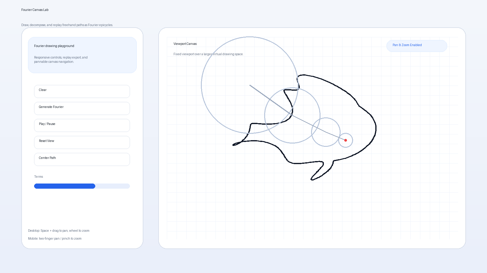
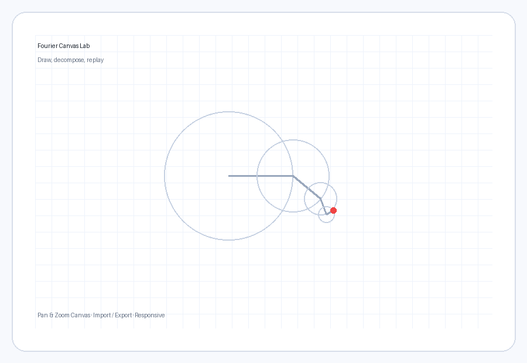

# Fourier Canvas Lab

[](https://dreaminmaster.github.io/fourier-visualizer-html/)
[](./README.zh-CN.md)

A browser-based Fourier drawing playground for sketching paths, decomposing them into epicycles, and replaying them with pannable, zoomable canvas navigation.



## Live Demo

- **Open Demo:** https://dreaminmaster.github.io/fourier-visualizer-html/

## Demo Preview



## Overview

Fourier Canvas Lab turns freehand 2D drawing into a Fourier reconstruction workflow that is both mathematical and visual.

- draw a path directly in the browser
- decompose it into rotating epicycles
- replay the shape as animated circles
- save and restore exact replay states with JSON
- navigate a larger virtual canvas with pan and zoom

The app is intentionally lightweight, static-host friendly, and usable on both desktop and mobile browsers.

## Features

- Continuous freehand drawing in the browser
- Fourier / epicycle reconstruction playback
- Adjustable term count for approximation comparison
- Copyable and exportable replay JSON
- Import from pasted JSON or JSON files
- Fixed viewport over a larger virtual canvas
- Desktop pan/zoom support
- Mobile two-finger pan and pinch zoom support
- Responsive layout for desktop and mobile use

## Quick Start

### Run locally

Open `index.html` directly in a browser.

### Deploy as a static site

Upload the folder to any static host, such as:

- GitHub Pages
- Cloudflare Pages
- Netlify
- Vercel

## Controls

### Desktop

- Draw with mouse or pen
- Hold `Space` and drag to pan
- Use the mouse wheel to zoom

### Mobile

- Draw with one finger
- Use two fingers to pan
- Pinch to zoom

## Project Structure

```text
index.html         # UI structure
style.css          # responsive layout and styling
app.js             # drawing, transform, animation, import/export logic
assets/cover.png   # project cover image
assets/demo.gif    # demo animation preview
README.md          # English documentation
README.zh-CN.md    # Chinese documentation
```

## How It Works

1. Capture a user-drawn polyline.
2. Resample it into evenly distributed points.
3. Apply a discrete Fourier transform over the 2D path.
4. Convert frequency components into epicycles.
5. Animate the endpoint to reconstruct the original trajectory.

## Data Format

The import/export JSON stores:

- raw points
- sampled points
- epicycle coefficients (`frequency`, `amplitude`, `phase`)
- playback settings
- viewport state

This makes it possible to copy, save, share, and replay the same drawing later.

## Notes

- The current prototype uses a direct DFT implementation for clarity.
- FFT can be introduced later as a performance optimization without changing the target transform.
- The current version is best suited for single-stroke continuous paths.

## Roadmap

Possible next steps:

- FFT-based acceleration
- SVG path import
- Better sampling around sharp turns
- Multi-stroke / multi-contour support
- Local persistence for recent drawings

## License

MIT
